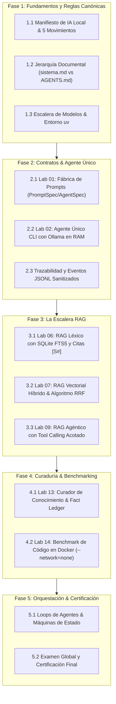

# 🎓 BL_Loops: Masterclass Interactiva de Agentes de IA Local

---

> [!CAUTION]
> # 📢 ATRIBUCIÓN Y RECONOCIMIENTO DE AUTORÍA INTELECTUAL 📢
> ## 🌟 TODOS LOS CRÉDITOS, INVESTIGACIÓN, ARQUITECTURA Y METODOLOGÍA PERTENECEN A:
> # 👑 [Cristrva1 / BL_Loops](https://github.com/Cristrva1/BL_Loops) 👑
> ### 👤 Autor Original: [@Cristrva1](https://github.com/Cristrva1)
> 🔗 **Repositorio Fuente Oficial:** 👉 [https://github.com/Cristrva1/BL_Loops](https://github.com/Cristrva1/BL_Loops) 👈
>
> ---
>
> ### 🛑 ACLARACIÓN DE AUTORÍA:
> **Las ideas, metodología, estructura pedagógica y arquitectura de agentes presentes en este proyecto NO SON MÍAS.**
> 
> Todo el mérito intelectual, la concepción del laboratorio, la escalera de modelos locales en Ollama, el diseño de la escalera RAG (FTS5 léxico, Vectorial Híbrido RRF y RAG Agéntico), las políticas de cero egress, las trazas JSONL sanitizadas y los benchmarks en Docker fueron creados y diseñados por **[Cristrva1](https://github.com/Cristrva1)** en su repositorio canónico **[BL_Loops](https://github.com/Cristrva1/BL_Loops)**.
>
> Este repositorio es únicamente un **visor didáctico interactivo / plataforma de aprendizaje visual (Masterclass)** construida para estudiar, interactuar y asimilar de forma visual el excelente trabajo del autor original.

---

## 🌟 Características de la Plataforma de Estudio

- **🎬 Reproductor de Aprendizaje tipo Video / Clase:**
  - Diapositivas dinámicas con conceptos clave, ideas fuerza y resúmenes ejecutivos.
  - Barra de línea de tiempo con selector de velocidad (`1.0x`, `1.25x`, `1.5x`).
- **🎙️ Narración por Voz (Speech Synthesis en Español):**
  - Al hacer clic en **Play**, el navegador lee la lección en voz alta utilizando la Web Speech API nativa.
- **💻 Terminal Interactiva (Windows PowerShell):**
  - Simula en vivo los comandos exactos de los laboratorios (`uv sync`, `naive-rag ask`, `vector-rag search`, `sales-agent chat`, `ollama list`).
- **🕸️ Grafo de Nodos & Máquina de Estados:**
  - Visualización interactiva de estados canónicos de BL_Loops: `idle`, `queued`, `running`, `waiting`, `done`, `failed`.
- **📑 Inspector de Contratos & Código Real:**
  - Visualiza los esquemas Pydantic (`PromptSpec`, `AgentSpec`), algoritmos de fusión RRF y sandboxes de Docker.
- **✅ Checkpoints y Progreso Persistente:**
  - Evaluaciones tipo test al final de cada sesión con feedback inmediato y guardado de avance en `localStorage`.

---

## 📚 Estructura del Curso (5 Fases & 12 Sesiones)



---

## 🚀 Cómo Ejecutar Localmente

No requiere servidores externos ni instalación de dependencias pesadas. Es 100% autocontenido en HTML5, Tailwind CSS y JavaScript moderno:

1. Simplemente abre `index.html` con doble clic en tu navegador preferido (Chrome, Edge, Firefox, Brave).
2. O desde PowerShell:
   ```powershell
   Start-Process index.html
   ```

---

## 🛡️ Principios del Repositorio Madre (BL_Loops)

1. **100% IA Local:** Inferencia mediante Ollama en loopback (`127.0.0.1:11434`). Cero fugas de datos (*zero egress*).
2. **Aislamiento Radical:** Cada laboratorio es autónomo, con su propio entorno `uv`, sus propias dependencias y sus propios datos locales.
3. **Didáctico y Visual:** Cada paso expone sus entradas, salidas, estados y latencias en trazas de auditoría sanitaria JSONL.

---

## 🤝 Reconocimiento Especial

Vayan todos los agradecimientos a **[Cristrva1](https://github.com/Cristrva1)** por idear, documentar y programar el laboratorio original [BL_Loops](https://github.com/Cristrva1/BL_Loops), un recurso formativo invaluable para la comunidad de desarrolladores de IA local.
